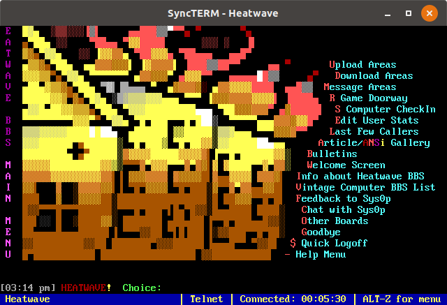

The following project was made in a collaborative effort whilst working on the Makers Bootcamp, the three other contributors to this project we're as below

https://github.com/lkilk
https://github.com/adamroy12
https://github.com/ChescaRobertson

Ive deposited this to my own repository for further development on my own version, the full version is located here

https://github.com/adamroy12/makersbbs--TeenageMutantNinjaCobolTurtles-


# Makers BBS
This program should be run in a terminal that is 132 x 43

The way to run the program remotely is to install Gnu cobol and any other dependencies, then navigate to project folder and use the following command in terminal

'./cbl run'
This week the goal is:

* Learn to build software in a team.

This week you'll be building a Bulletin Board System (BBS) in groups.

Bulletin Board Systems were very popular in the early days of the internet as a
place for emerging online communities. They were one of the predecessors of
today's social networks. Some still exist if you go looking.

Here's an example of one. Yours will be much simpler!



[(Source)](https://twobithistory.org/2020/02/02/bbs.html)

## How do we make software in a team?

Many books have been written on this. We'll start you off with some simple
guiding principles, and a basic but productive workflow.

### Guiding Principles

You'll know if you're functioning well in a team if:

* **You're merging features into the main branch.**  
  This means that you're getting work done, reviewed, improved, and into the main branch of the codebase. If you've got work languishing or stalling, you probably need to break down your work into smaller pieces so that you can merge faster.

* **Everyone is contributing.**  
  No one should be sitting around waiting, no one should be passively letting the team get on with things. If this happens, you are wasting energy that can be going into building software.

* **You feel good.**  
  That means you're well-rested, taking care of yourselves, speaking and listening to each other. Treat frustration like thirst — not a problem to suppress, but a helpful signal from yourself to surface and figure out how to fix. Don't stew!

If you'd like to learn more about how to tell if things are going well, consider reading the [XP Values](http://www.extremeprogramming.org/values.html).

### Team Setup

1. **Name your team.**  
   Choose something you all like (Coldplay?), and name your team after that!

2. **Agree your working practices.**  
   It is much easier to agree up front than find out you have differing views half way through. Consider agreeing and writing down these points:

   * When will you start and finish working for the day?
   * How often will you take breaks?
   * Your cycle of stand-ups and retrospectives?  
     Suggestion: stand-ups at the start of each day, and short retrospectives at the end of each day.
   * If someone feels frustrated or hopes for a change, how should they raise it with the team?

3. **Set up your project and card board.**  
   1. Ask one person to fork this repository to use as your own.
   2. Add team members and project coaches as project collaborators.
   3. Rename the repository to `makersbbs-<Team Name>`.
   4. Add team members and project coaches.
   5. Update your Github `README.md` to link to the Trello board.

4. **Create a team Slack channel.**  
   Put links to your card board & Github repo in the title, and invite your coaches for this module.

5. **Get yourself a hot drink!**  
   That's the setup done.

### Planning

You'll want to do this once at the start of your project, and then at the start of every day.

Load up the Project Board, which you can find in your repo in the 'Projects' tab.

Then, as a team:

1. **Review the Project board.**  
   Get a general update on what's changed since the last planning session. What have you done? What work is still in progress? Is anything blocked?

2. **Decide what to do next.**  
   How can you arrange the work so that everyone has something to do? Can you avoid working on the same areas of the codebase? If not, how will you coordinate?

3. **Break down the big epic features into smaller tickets.**  
   You ideally want to break down work into pieces of user-facing functionality that won't take you longer than a half a day to implement. This will ensure you are merging new code regularly.

4. **Allocate the tickets to pairs.**  
   Again, try to ensure you're maximising the contribution of everyone in the team.

5. **Get going!**  
   Take a break beforehand if you feel best.

### Coding

Each pair should:

1. **Assign themselves to the card and move it to 'In Progress'.**  
   In a real development team, this would make sure no one else takes it on!

2. **Create a branch for the change.**  
   Call it something relevant to the feature.

3. **Implement the change.**  
   This will involve pairing and programming, but it might also involve taking a bit of time out to research. As always, when pairing, make sure you take breaks, and make sure you're spending an equal amount of time driving and navigating.

4. **Create a pull request.**  
   When you're satisfied your work is production quality, create a pull request and ask the other team to review it. Make sure to respond to requests for review in a timely fashion to avoid wasted time.

5. **Respond to the review.**  
   Is your code perfect? Very unlikely at this point in your career! A good code review will involve comments and those comments should lead you to improve your code, so do that.

6. **When your PR is approved, merge your code into the main branch.**  
   It's the branch owner's responsibility to merge it, resolve any conflicts, and ensure the new main branch works post-merge.

7. **Deploy to your server.**
   In a production dev team, they would likely supervise an automated deployment process. This week, you can run the `deploy.sh` script.

Then it's back to the start! If you've not agreed as a team what to do next, then it's time for another planning session.

### Retrospection

Here are some points to consider at your retrospectives:

* How much fun did you have today? 1-10
* What have we implemented? Demo for each other!

## What are we going to build?

### The seed

We've provided a seed to start you off. It has two screens to start.

### Login (given)
```
        Makers BBS

        What's your name?

        Kay_______
```

### Menu (given)
```
        Makers BBS

        Welcome, Kay

        (n) Nothing            (l) Logout             (q) Quit

        Pick: _
```

### Deployment

We've also deployed it for you. Your coach will have given you some files to put
into the `private/` directory. Once you do that, you should be able to run:

```shell
; ./deploy.sh  # To deploy to the server
; ./connect.sh # To connect to your server
```

### Your features

Your task is to build out some further features according to the specifications
below. If you like, you can use some creative license to improve their
appearance.

#### Message Board

Here are the user stories and screens for this feature. User stories are a
useful way to specify the intent of a piece of software by specifying the
desires of the user.

> As a BBS user  
> I want to see list messages posted by other users  
> So that I can pick out one I'd like to read.

```
        Makers BBS

        Here are the last 10 messages:

        1.  Hello, world
        2.  Is anyone out there?
        3.  Advert for a FRIDGE for sale.
        4.  I'm lonely.
        5.  Horseriding lessons.
        6.  Jim's great. I just want to say that.
        7.  How's the weather?
        8.  I can't post photos so here's a description of my cat.
        9.  My nice poems.
        10. Hello!

        ( ) Read the full message by number
        (p) Post a message of your own
        (n) Next page            (p) Previous page      (q) Go back

        Pick: __
```

> As a BBS user  
> I want to read a message  
> So that I can learn the information it contains  

```
        Makers BBS

        Title: Is there anyone out there?

        I've trapped my hand in my laptop and I can't get it out!

        It's causing me a lot of trouble brushing my hair.

        Can anyone help?

        (n) Next message         (p) Previous message   (q) Go back

        Pick: __
```

> As a BBS user  
> I want to post a message  
> So that I can tell other people things

```
        Makers BBS

        Post a message

        Title
        __________________________________________________

        Body
        __________________________________________________
        __________________________________________________
        __________________________________________________
        __________________________________________________
        __________________________________________________
        __________________________________________________
        __________________________________________________

        (p) Post               (d) Discard

        Pick: __
```

#### Word Guessing Game

> As a BBS user  
> I want play a game  
> So that I can enjoy a fun diversion

```
        Makers BBS

        Guess this word:

        *b*c**

        Guesses left: 6

        ( ) Enter a letter to guess
        (!) Quit game

        Pick: _
```

```
        Makers BBS

        You guessed the word!

        abacus

        Guesses left: 3

        (p) Play again
        (h) See high scores
        (!) Quit game

        Pick: _
```

```
        Makers BBS

        You lost!

        abac*s

        Guesses left: 0

        (p) Play again
        (h) See high scores
        (!) Quit game

        Pick: _
```

```
        Makers BBS

        High scores:

        Kay         18
        Steph       16
        Jess        12
        
        (b) Go back

        Pick: _
```

The score is the length of the word multiplied by the guesses left when they
guess it correctly.

#### Additional Features

When you've completed those, pick from these for more challenge:

> As a BBS user  
> I want to see who posted a message on the message board  
> So that I know who to contact

> As a BBS user  
> I want to sign up with a username and password  
> So no one can pretend to be me on the BBS

> As a BBS User  
> I want to see the current time on every screen  
> So I can know at a glance how long I've been online

> As a BBS owner  
> I want to have a cool title screen  
> So my users will be impressed

Feel free to invent your own features, though it may be worth running them by
a coach to check they won't end up prohibitively difficult!
